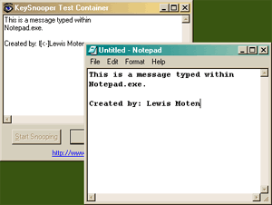

<div align="center">

## Key Snooper


</div>

### Description

Monitor any key typed on the keyboard. Use the GUI to test, or supply a file name and run in the background. Uses GetAsyncKeyState API and GetKeyState. Great for finding out what children or spouses are doing on the internet. Instructions included to start the program when the Operating system starts.
 
### More Info
 


<span>             |<span>
---                |---
**Submitted On**   |2002-08-05 22:11:46
**By**             |[Lewis E\. Moten III](https://github.com/Planet-Source-Code/PSCIndex/blob/master/ByAuthor/lewis-e-moten-iii.md)
**Level**          |Intermediate
**User Rating**    |4.8 (43 globes from 9 users)
**Compatibility**  |VB 6\.0
**Category**       |[Complete Applications](https://github.com/Planet-Source-Code/PSCIndex/blob/master/ByCategory/complete-applications__1-27.md)
**World**          |[Visual Basic](https://github.com/Planet-Source-Code/PSCIndex/blob/master/ByWorld/visual-basic.md)
**Archive File**   |[Key\_Snoope114766852002\.zip](https://github.com/Planet-Source-Code/lewis-e-moten-iii-key-snooper__1-37658/archive/master.zip)

### API Declarations

```
Private Declare Function GetAsyncKeyState Lib "user32" (ByVal vKey As Long) As Integer
Private Declare Function GetKeyState Lib "user32" (ByVal nVirtKey As Long) As Integer
```


